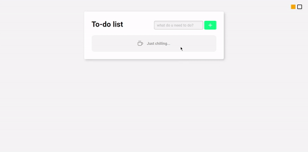

<h1> To-do </h1>

  <a href="#-technologies">Technologies</a>&nbsp;&nbsp;&nbsp;|&nbsp;&nbsp;&nbsp;
  <a href="#memo-license">License</a>

  

 

  

## 🚀 Technologies

This project was developed using these technologies:

- HTML, CSS e JS
- Git e Github

You can take a look by <a href="https://adrianmedeirosdev.github.io/to-do" target="_blank">clicking here</a>.

## :memo: License

This project is under the MIT license.

---
